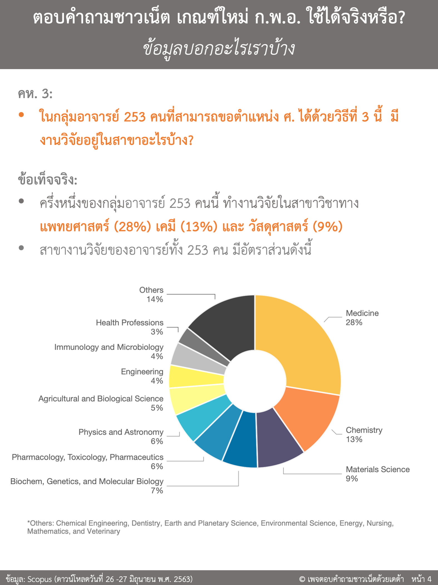

Today, we posted the very first topic that many researchers in Thailand are currently discussing very widely. 

Thailand recently passed the new academic ranking criteria and procedure (June 2020) to determine who would be able to request for Professor, Associate Professor, and Assistant Professor titles. In summary, Assistant Professor criteria remains almost the same compared to previous criteria that was announced in 2017. However, an additional option (method 3) was introduced for Associate Professor and Professor title requests, which have brought a lot of attention and criticism from Thailand researchers. 

For example, in method 3, Professor appointment requester must have h-index = 18 or more, citations = 1000 or more, 10 Q1/Q2 manuscripts, and lead PI in 10 projects to be eligible for this method. Two main arguments that are currently being discussed widely about this method include 1) method 3 would not be practical for Thai researchers and some famous researchers/Professors do not pass this criteria and 2) many researchers meet this criteria and requesters should earn their title. 

While both arguments provide several examples to support their cases, we think that additional data would be essential to identify opinion vs facts of method 3 in the new academic ranking criteria. Therefore, we collected citations and h-index of researchers from 9 universities, which are part of Thailand research universities. In total, we were able to gather data of 60,329 researchers from publicly available information via Scopus (data retrieved on June 26-27, 2020), and we would like to learn from these data about Thai researchers.

We hope that our first post will pave the way to a better future for discussion in the community where opinions/discussion would be supported by actual data/facts.

[See our first facebook post here](https://www.facebook.com/ตอบคำถามชาวเน็ตด้วยเดต้า-109244777513155/?view_public_for=109244777513155)

